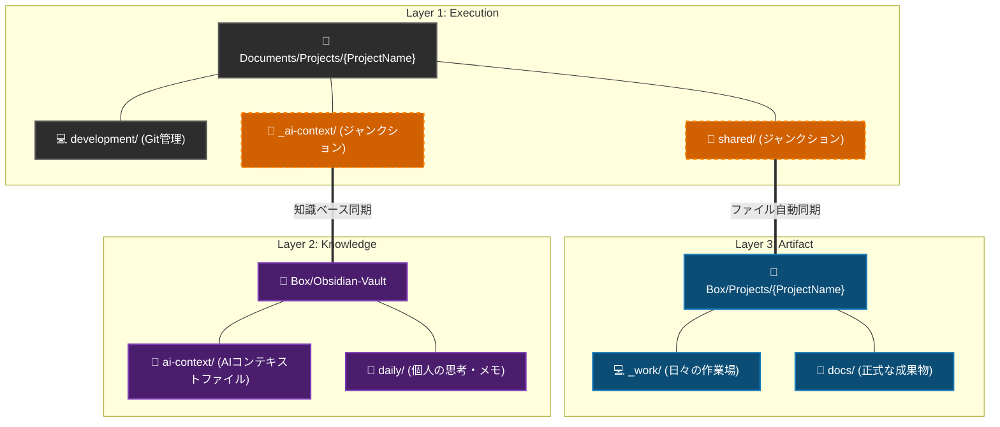
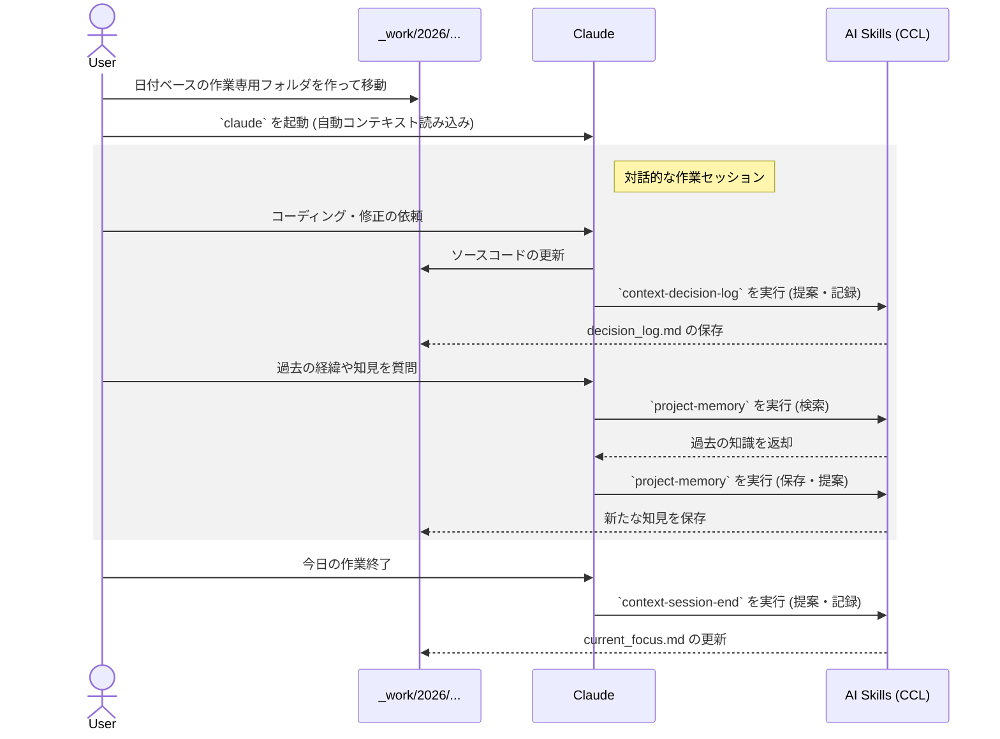

# ai-collab-folder-structure

<!--  -->

AI(Claude Code)との協働を前提とした、プロジェクトフォルダ管理フレームワークです。

## 概要

複数プロジェクトを整理し、AIとのコンテキスト共有を最適化するための3層構造ワークスペースです。

- Layer 1 (Execution): ローカル作業領域(Git管理、揮発性の高い作業)
- Layer 2 (Knowledge): Obsidian Vault(思考・知見の蓄積、BOX同期)
- Layer 3 (Artifact): 成果物・参照資料(ファイルバックアップ・PC間同期、BOX同期)

## 3層レイヤー構造



| Layer | 役割 | 場所 | データの性質 |
|-------|------|------|-------------|
| Layer 1: Execution | 作業場 | Documents/Projects/{案件}/ (Local) | WIP、揮発性が高い |
| Layer 2: Knowledge | 思考・知識 | Box/Obsidian-Vault/ (BOX Sync) | 文脈、経緯、知見 |
| Layer 3: Artifact | 成果物・参照 | Box/Projects/{案件}/ (BOX Sync) | バックアップ・PC間同期ドキュメント |

## AIとの協働ワークフロー

本アーキテクチャでは、AIエージェントの拡張機能である「SKILL」と「Context Compression Layer (CCL)」をコア機能として統合し、シームレスな協働作業を実現します。

### Context Compression Layer (CCL)

セッション跨ぎのAIコンテキスト管理 - AIが過去の文脈を正しく理解し、作業の継続性を保つための仕組み:

- 構成要素: project_summary.md (全体像), current_focus.md (今のフォーカス), decision_log (意思決定履歴), memories (プロジェクトメモリ)
- 自動連携: セッション開始時に `AGENTS.md` (または `CLAUDE.md`) がCCLの内容を読み込み、現在の状況を把握
- AIスキルとの統合: 後述のカスタムAIスキルを通じて、AI自身がコンテキストファイルの維持をサポート

### カスタムAIスキル (Custom AI Skills)

プロジェクトのコンテキスト管理をAI自身に自律的に行わせるための拡張機能です。

- `context-decision-log`: 作業中や会議での暗黙的な決定事項を検出し、構造化された意思決定ログとして記録を提案
- `context-session-end`: 作業の区切りで、AIが関与した作業内容のみを `current_focus.md` へ追記提案
- `project-memory`: プロジェクト固有の知識ベース。AIが作業中に発見した価値ある知見をプロジェクトメモリとして記録・検索

### ワークフロー例 (Claude Code)

日々の作業はBOX同期対象の `_work` フォルダ内で、日付ベースの作業フォルダを作成して行います。
Claude CodeとカスタムAIスキル（SKILL）を活用することで、作業の文脈を失わずに効率的に進めることができます。



#### 1. 作業フォルダの作成と移動

```bash
# 日付ベースの作業専用フォルダを作成・移動
cd Box\Projects\NewProject\_work
mkdir 2026\202602_feature_x
cd 2026\202602_feature_x

# Claude Codeを起動（自動的にプロジェクトのコンテキストが読み込まれます）
claude
```

#### 2. Claude Codeとの作業（SKILLの活用）

作業を進める中で、AI自身が状況を判断し、適切なタイミングでSKILLの実行を提案してくれます。

👨‍💻 User:  
`src/api/auth.ts` のログイン処理を改善して。トークンの有効期限切れエラー時にはリフレッシュ処理を挟むようにしたい。

🤖 Claude:  
（コードの修正後...）
修正が完了しました。
この実装方針の変更はアーキテクチャに影響を与えるため、`context-decision-log` スキルを使って意思決定ログに記録しておきましょうか？

👨‍💻 User:  
お願い。

🤖 Claude:  
（`context-decision-log` スキルを実行し、`decision_log.md` に「トークンリフレッシュ処理の追加」を記録）

👨‍💻 User:  
今日の作業はここまで。

🤖 Claude:  
承知しました。セッションを終了する前に、`context-session-end` スキルを使用して、本日の進捗（ログイン処理の改善）を `current_focus.md` に追記しておきますか？

👨‍💻 User:  
はい、よろしく。

#### 3. プロジェクト固有メモリの活用（project-memory）

作業中に得た知見や、既存の知識を引き出す際にもSKILLが活躍します（検索と記録の2つの用途）。

👨‍💻 User:  
以前、このプロジェクトでDB接続のタイムアウト問題に対処した時の構成ってどうなってたっけ？

🤖 Claude:  
（`project-memory` スキルで検索を実行...）
プロジェクトメモリから該当の知見が見つかりました。
2026年1月に記録された `db_timeout_config.md` によると、コネクションプールの設定値を...

👨‍💻 User:  
なるほど、ありがとう。ところで、今回新しく追加したRedisのキャッシュ戦略について、今後も参照しそうなので保存しておいて。

🤖 Claude:  
承知しました。`project-memory` スキルを使用して、今回のRedisキャッシュ戦略を `redis_cache_strategy.md` としてプロジェクトメモリに記録しておきます。

#### 4. このワークフローの利点

このように `_work` フォルダで作業を進めることで以下のメリットがあります。
- 作業の過程（一時ファイルなど）は `docs` などの正式なドキュメント群を汚しません
- 重要な意思決定（`decision_log.md`）や進捗（`current_focus.md`）のみが、AIスキルによって自動的に引き上げられ記録されます
- 次回作業時に、AIが最新の `current_focus.md` を読み込むため、すぐに作業を再開できます

## ワークスペース構成の詳細

### 2種類のプロジェクト Tier

| Tier | 配置先 | 用途 | 構成 |
|------|--------|------|------|
| full | `Projects/{案件}/` | メイン案件 | 全機能(_ai-workspace、構造化フォルダ) |
| mini | `Projects/_mini/{案件}/` | お手伝い系 | 軽量構成(最小限のフォルダ) |

### full tier の Structure オプション

full tier では、BOX側(Layer 3)のドキュメント構造を2種類から選択できます。

| Structure | 説明 |
|-----------|------|
| new (デフォルト) | 用途別分類(docs/reference/records) |
| legacy | フェーズ番号ベース(01_planning 〜 10_reference) |

### 2PC間の同期戦略

- BOX同期: Obsidian Vault、shared/ 経由の成果物
- Git同期: ソースコード(development/source/)
- ローカル独立: _ai-workspace/

### ワークスペース全体の構成

```
Documents/Projects/
├── _config/
│   └── paths.json              # ワークスペース共通パス定義
├── _projectTemplate/           # プロジェクトテンプレート・管理スクリプト
│   ├── scripts/
│   │   ├── project_manager.ps1     # GUIプロジェクトマネージャー
│   │   ├── setup_project.ps1       # プロジェクト初期セットアップ
│   │   ├── check_project.ps1       # 健全性チェック
│   │   ├── archive_project.ps1     # 完了プロジェクトのアーカイブ
│   │   ├── config.template.json    # 設定ファイルテンプレート
│   │   └── manager/                   # GUIマネージャーモジュール
├── exec_project_manager.cmd       # GUIマネージャー起動用バッチ (Projects ルート)
│   ├── context-compression-layer/  # AIコンテキスト圧縮層セットアップ
│   │   ├── setup_context_layer.ps1 # コンテキスト層セットアップスクリプト
│   │   ├── templates/              # コンテキストファイルテンプレート
│   │   ├── examples/               # 使用例
│   │   ├── skills/                 # コンテキスト管理用Agentスキル
│   │   ├── README.md               # 英語ドキュメント
│   │   └── README-ja.md            # 日本語ドキュメント
│   ├── AGENTS.md               # 新規プロジェクト用AI指示書テンプレート
│   ├── CLAUDE.md               # AGENTS.mdのコピー (Claude CLI用)
│   └── README.md               # テンプレート詳細ドキュメント
├── _globalScripts/             # プロジェクト横断スクリプト
│   ├── sync_from_asana.py      # Asana → Markdown同期
│   └── config.json.example     # Asana同期の設定例
├── _archive/                   # アーカイブ済みプロジェクト
│   └── _mini/               # アーカイブ済み mini tier プロジェクト
├── _mini/                   # mini tier プロジェクト群
├── .context/                   # ワークスペースAIコンテキスト
│   └── active_projects.md      # アクティブプロジェクト一覧
├── _ai-workspace/              # ワークスペース全体のAI分析・実験用
├── CLAUDE.md                   # ワークスペース全体のAI指示書
├── README.md                   # 本ファイル
├── workspace-architecture.md   # 詳細設計ドキュメント
└── {ProjectName}/              # 各プロジェクト (full tier)
```

### プロジェクトフォルダ構成

#### full tier

```
Documents/Projects/{ProjectName}/
├── _ai-context/                # AI Context & Obsidian Junction [Local]
│   └── obsidian_notes/         # Junction → Box/Obsidian-Vault/Projects/{ProjectName}
├── _ai-workspace/              # AI分析・実験用 [Local]
├── development/                # 開発関連 [Local - Git管理]
│   ├── source/                 # ソースコード
│   ├── config/                 # 設定ファイル
│   └── scripts/                # 開発スクリプト
├── shared/                     # Junction → Box/Projects/{ProjectName}
├── AGENTS.md                   # Copy from shared/AGENTS.md
└── CLAUDE.md                   # Copy from shared/AGENTS.md

Box/Projects/{ProjectName}/         (new 構造)
├── CLAUDE.md                   # AI指示書 (実体)
├── docs/                       # 作成・編集ドキュメント
│   ├── planning/               # 企画・要件定義・提案書
│   ├── design/                 # 設計書
│   ├── testing/                # テスト計画・ケース・結果
│   └── release/                # リリース・移行手順
├── reference/                  # 参考資料 (読むだけ・保存用)
│   ├── vendor/                 # ベンダー提供資料
│   ├── standards/              # 社内規約・標準
│   └── external/               # その他外部資料
├── records/                    # 記録・履歴 (証跡)
│   ├── minutes/                # 議事録
│   ├── reports/                # 進捗報告
│   └── reviews/                # レビュー記録
└── _work/                      # 日付ベースの作業フォルダ
```

#### mini tier

```
Documents/Projects/_mini/{ProjectName}/
├── _ai-context/                # AI Context & Obsidian Junction [Local]
│   └── obsidian_notes/         # Junction → Box/Obsidian-Vault/Projects/_mini/{ProjectName}
├── development/                # 開発関連 [Local]
│   ├── source/                 # ソースコード (Git管理)
│   └── config/                 # 設定ファイル
├── shared/                     # Junction → Box/Projects/_mini/{ProjectName}
├── AGENTS.md                   # Copy from shared/AGENTS.md
└── CLAUDE.md                   # Copy from shared/AGENTS.md

Box/Projects/_mini/{ProjectName}/
├── CLAUDE.md                   # AI指示書 (実体)
├── docs/                       # ドキュメント (flat - サブフォルダなし)
└── _work/                      # 作業フォルダ
```

### リンク構成

| 種類 | ローカル側 | リンク先 (BOX側) | 管理者権限 |
|------|-----------|-----------------|-----------|
| Junction | shared/ | Box/Projects/{ProjectName}/ | 不要 |
| Junction | _ai-context/obsidian_notes/ | Box/Obsidian-Vault/Projects/{ProjectName}/ | 不要 |

## クイックスタート

### 1. 前提条件

`Documents/Projects/_config/paths.json` を作成:

```json
{
  "localProjectsRoot": "Documents\\Projects",
  "boxProjectsRoot": "Box\\Projects",
  "obsidianVaultRoot": "Box\\Obsidian-Vault"
}
```

各値は `%USERPROFILE%` からの相対パスです。

### 2. GUIマネージャーで操作 (推奨)

```powershell
powershell -ExecutionPolicy Bypass -File "%USERPROFILE%\Documents\Projects\_projectTemplate\scripts\project_manager.ps1"
```

または Projects ルートの `exec_project_manager.cmd` をダブルクリックでも起動できます。

機能:
- Dashboard タブ: プロジェクト概要とクイックアクション
- Editor タブ: プロジェクトファイルの閲覧・編集
- Setup タブ: プロジェクト名、Structure、Tier を選択してセットアップ
- AI Context タブ: プロジェクトへのContext Compression Layerセットアップ
- Check タブ: 既存プロジェクトの健全性チェック
- Archive タブ: DryRun プレビュー付きでアーカイブ実行
- 出力エリアにスクリプトの実行結果をリアルタイム表示
- カスタムダークテーマタイトルバー (Catppuccin Mocha)

### 3. コマンドラインで操作

```powershell
# メイン案件 (full tier, new 構造 - デフォルト)
.\_projectTemplate\scripts\setup_project.ps1 -ProjectName "NewProject"

# メイン案件 (full tier, legacy 構造)
.\_projectTemplate\scripts\setup_project.ps1 -ProjectName "NewProject" -Structure legacy

# お手伝い系 (mini tier)
.\_projectTemplate\scripts\setup_project.ps1 -ProjectName "SupportProject" -Tier mini
```

### 4. 健全性チェック

```powershell
# メイン案件
.\_projectTemplate\scripts\check_project.ps1 -ProjectName "NewProject"

# お手伝い系
.\_projectTemplate\scripts\check_project.ps1 -ProjectName "SupportProject" -Mini
```

### 5. プロジェクトのアーカイブ

```powershell
# DryRun で確認 (実際には何も変更しない)
.\_projectTemplate\scripts\archive_project.ps1 -ProjectName "MyProject" -DryRun

# 実行
.\_projectTemplate\scripts\archive_project.ps1 -ProjectName "MyProject"

# お手伝い系
.\_projectTemplate\scripts\archive_project.ps1 -ProjectName "SupportProject" -Mini -DryRun
```

アーカイブは3層すべてを `_archive/` に移動します。mini tier は `_archive/_mini/` 配下に移動されます。

### 6. PC-B でのセットアップ

BOX同期完了後、同じスクリプトを実行するだけでジャンクションとシンボリックリンクが作成されます:

```powershell
.\_projectTemplate\scripts\setup_project.ps1 -ProjectName "NewProject"
```

- `_config/paths.json` は各PCで個別に作成が必要(BOX非同期)
- CLAUDE.md/AGENTS.md はスクリプトにより自動的にコピーされます。

## スクリプト一覧

### _projectTemplate/scripts/

| スクリプト | 用途 |
|-----------|------|
| `project_manager.ps1` | GUI プロジェクトマネージャー(全スクリプトを統合) |
| `setup_project.ps1` | プロジェクト初期セットアップ |
| `check_project.ps1` | 健全性チェック |
| `archive_project.ps1` | 完了プロジェクトのアーカイブ |
| `convert_tier.ps1` | Tier 変換 (mini <-> full) |
| `config.template.json` | 設定ファイルテンプレート |
| `exec_project_manager.cmd` | GUIマネージャー起動用バッチファイル (Projects ルート) |

### context-compression-layer/

| ファイル | 用途 |
|---------|------|
| `setup_context_layer.ps1` | プロジェクトへのContext Compression Layerセットアップ (CLAUDE.mdへのCCL指示自動追記) |
| `save_focus_snapshot.ps1` | current_focus.mdの日次スナップショット保存 |
| `templates/` | AIコンテキストファイルテンプレート (project_summary, current_focus, file_map, decision_log等) |
| `templates/CLAUDE_MD_SNIPPET.md` | CLAUDE.mdに追記するCCL指示 |
| `examples/` | 使用パターンの例 |
| `skills/` | AIエージェントスキル for コンテキスト管理 |
| `skills/context-decision-log/` | 構造化意思決定ログの記録、暗黙的決定の検出 |
| `skills/context-session-end/` | current_focus.mdへのAI作業分追記提案 |
| `skills/project-memory/` | プロジェクト固有のメモリ - 知見の保存と検索 |

### _globalScripts/

| スクリプト | 用途 |
|-----------|------|
| `sync_from_asana.py` | Asanaタスク → Markdown同期 |
| `config.json.example` | Asana同期の設定ファイル例 |

## ドキュメント

- [workspace-architecture.md](./workspace-architecture.md) - 詳細設計ドキュメント
- [_projectTemplate/README.md](./Projects/_projectTemplate/README.md) - テンプレート詳細ドキュメント
- [CLAUDE.md](./Projects/CLAUDE.md) - ワークスペース全体のAI指示書

## 制約事項

- Windows専用(ジャンクション・PowerShellスクリプト)
- BOX Driveが必要(Layer 2/3の同期)
- 同一ボリューム内でのみジャンクションが有効
- .ps1 スクリプトは Shift_JIS (cp932) で記述、出力は UTF-8
- Obsidian Vault は2台のPCで同時に開かない(データ上書き防止)

## License

MIT License
