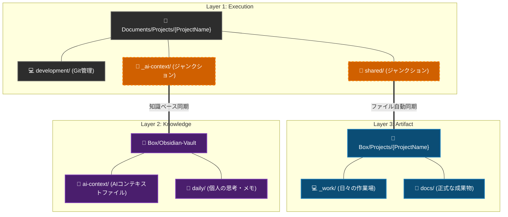
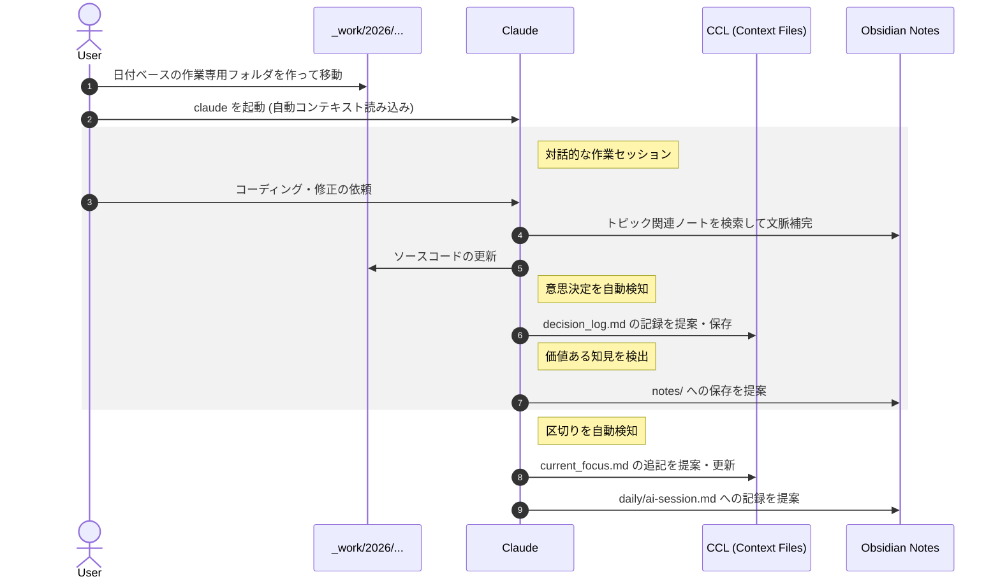

# ai-collab-folder-structure

<!--  -->

AI(Claude Code)との協働を前提とした、プロジェクトフォルダ管理フレームワークです。

## 概要

複数プロジェクトを整理し、AIとのコンテキスト共有を最適化するための3層構造ワークスペースです。

- Layer 1 (Execution): ローカル作業領域(Git管理、揮発性の高い作業)
- Layer 2 (Knowledge): Obsidian Vault(思考・知見の蓄積、BOX同期)
- Layer 3 (Artifact): 成果物・参照資料(ファイルバックアップ・PC間同期、BOX同期)

## 必須要件・制約事項

- Windows専用(ジャンクション・PowerShellスクリプト)
- BOX Driveが必要(Layer 2/3の同期)

## 3層レイヤー構造



| Layer | 役割 | 場所 | データの性質 |
|-------|------|------|-------------|
| Layer 1: Execution | 作業場 | Documents/Projects/{案件}/ (Local) | WIP、揮発性が高い |
| Layer 2: Knowledge | 思考・知識 | Box/Obsidian-Vault/ (BOX Sync) | 文脈、経緯、知見 |
| Layer 3: Artifact | 成果物・参照 | Box/Projects/{案件}/ (BOX Sync) | バックアップ・PC間同期ドキュメント |

## AIとの協働ワークフロー

本アーキテクチャでは、Context Compression Layer (CCL) とAIの自律行動規範をコア機能として統合し、ユーザーが明示的にスキルを呼び出さなくてもAIが自然に文脈管理を行うシームレスな協働作業を実現します。

### Context Compression Layer (CCL)

セッション跨ぎのAIコンテキスト管理 - AIが過去の文脈を正しく理解し、作業の継続性を保つための仕組み:

- 構成要素: project_summary.md (全体像、目安300トークン), current_focus.md (今のフォーカス、目安500トークン), tensions.md (未解決トレードオフ・懸念事項), decision_log (意思決定履歴)
- Session Start Protocol: セッション開始時にAIがコンテキストファイルを優先順位順に読み込み (current_focus → project_summary → tensions → decision_log)、未完了作業を1〜2行でサマリー提示。前回更新が3日以上前の場合のみ進捗を1回確認
- 承認モデル: Auto (current_focus.md への追記)、Notify (tensions.md、低影響 decision_log)、Confirm (project_summary.md、高影響 decision_log)
- AI自律行動: AIが会話の流れから意思決定や作業の区切りを検知し、自分からコンテキストファイルの更新を提案。未解決トレードオフを検出した際は tensions.md への記録を提案。ファイルが目安サイズを超えた場合は focus_history/ へのアーカイブを提案

### AI自律行動規範

AIはCLAUDE.mdに記述された行動規範に従い、以下を自律的に実行します。ユーザーがスキル名を意識して呼び出す必要はありません。

- 未解決課題の検出と記録: 会話中にトレードオフや未決定事項を検出し、`tensions.md` への記録を提案。解決時は削除と decision_log への昇格を提案
- 意思決定の検出と記録: 会話中の暗黙的な決定事項（技術選定、設計判断等）を検出し、構造化された意思決定ログとして記録を提案
- セッション終了の検知: 作業の区切りを自然に検知し、AIが関与した作業内容のみを `current_focus.md` へ追記提案
- Obsidian ナレッジ連携: `_ai-context/obsidian_notes/` を読んで文脈を補完し、作業中の発見やセッションの成果をVaultに還元。プロジェクト横断で再利用できる知見はVaultルートの `{obsidianVaultRoot}/ai-context/` ハブ (tech-patterns/, lessons-learned/) に振り分け提案。AI生成ノートには `#ai-memory` タグを付与

### ワークフロー例 (Claude Code)

日々の作業はBOX同期対象の `_work` フォルダ内で、日付ベースの作業フォルダを作成して行います。
AIは行動規範に従って自律的にコンテキスト管理を行うため、ユーザーは普段スキルの存在を意識する必要はありません。



#### 1. 作業フォルダの作成と移動

```bash
# 日付ベースの作業専用フォルダを作成・移動
cd Box\Projects\NewProject\_work
mkdir 2026\202602_feature_x
cd 2026\202602_feature_x

# Claude Codeを起動（自動的にプロジェクトのコンテキストが読み込まれます）
claude
```

#### 2. Claude Codeとの作業（AIが自律的に記録）

ユーザーは通常の作業を進めるだけで、AIが状況を判断して適切なタイミングで記録を提案します。

> 👨‍💻 User:
> `src/api/auth.ts` のログイン処理を改善して。トークンの有効期限切れエラー時にはリフレッシュ処理を挟むようにしたい。
> 
> 🤖 Claude:
> （コードの修正後...）
> 修正が完了しました。
> 💡 Decision Logに記録しますか？ → 認証フローにトークンリフレッシュ処理を追加
> 
> 👨‍💻 User:
> お願い。
> 
> 🤖 Claude:
> `decision_log.md` に記録しました。
> 
> 👨‍💻 User:
> 今日の作業はここまで。
> 
> 🤖 Claude:
> 📝 current_focus.md に追記しますか？
> 
> 【最近あったこと】に追加:
>   + [AI] auth.ts のトークンリフレッシュ処理を実装
>   + [AI] 認証フロー変更をDecision Logに記録
> 
> （はい / 修正あり / 不要）

#### 3. Obsidian ナレッジ連携（AIがVaultと双方向に連携・知見の蓄積）

AIは `_ai-context/obsidian_notes/` を通じてObsidian Vaultを参照し、作業の成果や技術的な知見を蓄積します。

> 👨‍💻 User:
> 以前、このプロジェクトでDB接続のタイムアウト問題に対処した時の構成ってどうなってたっけ？
> 
> 🤖 Claude:
> `obsidian_notes/notes/` を検索しました。
> 2026年1月に記録された `db_timeout_config.md` によると、コネクションプールの設定値を...
> 
> 👨‍💻 User:
> なるほど、ありがとう。それを踏まえて、先週の認証フロー見直し会議の決定事項はどうだっけ？
> 
> 🤖 Claude:
> `obsidian_notes/meetings/` を確認します。
> `2026-02-17_authentication-review.md` に議事録がありました。主な決定事項は...
> （内容を踏まえて実装の方針を提案）
> 
> 👨‍💻 User:
> 完璧、その方針で進めて。今日はここまで。
> 
> 🤖 Claude:
> 📝 current_focus.md に追記しますか？
> 
> 【最近あったこと】に追加:
>   + [AI] auth.ts のトークンリフレッシュ処理を実装
> 
> 📓 今回のRedisキャッシュ戦略は今後も参照価値がありそうです。Obsidianにも記録しておきますか？
> → notes/redis-cache-strategy.md
>   Redis キャッシュ戦略: TTL設計とキー命名規則
> 
> （はい / 修正あり / 不要）

#### 4. このワークフローの利点

このように `_work` フォルダで作業を進めることで以下のメリットがあります。
- 作業の過程（一時ファイルなど）は `docs` などの正式なドキュメント群を汚しません
- 重要な意思決定（`decision_log.md`）や進捗（`current_focus.md`）のみが、AIの自律的な判断によって引き上げられ記録されます
- 次回作業時に、AIが最新の `current_focus.md` を読み込むため、すぐに作業を再開できます
- AIがObsidian Vaultの過去の会議メモや知見を参照して文脈補完するため、背景説明の手間が減ります
- AI作業の成果がObsidian Vaultに蓄積され、プロジェクトのナレッジベースが育ちます

## ワークスペース構成の詳細

### 2種類のプロジェクト Tier

| Tier | 配置先 | 用途 | 構成 |
|------|--------|------|------|
| full | `Projects/{案件}/` | メイン案件 | 全機能(_ai-workspace、構造化フォルダ) |
| mini | `Projects/_mini/{案件}/` | お手伝い系 | 軽量構成(最小限のフォルダ) |

### Multi-CLI対応

複数のAI CLIエージェント (Claude Code, Codex CLI, Gemini CLI 等) が混在する環境下でも、プロジェクト指示とコンテキストを一本化する仕組みを採用しています。マスターとなる指示書は `shared/AGENTS.md` (Layer 3) に一元管理し、各CLIが要求する固有のファイル名 (`CLAUDE.md` 等) にはそのコピーを配置します。詳細は [workspace-architecture.md](./workspace-architecture.md) を参照してください。

### 2PC間の同期戦略

- BOX同期: Obsidian Vault、shared/ 経由の成果物
- Git同期: ソースコード(development/source/)
- ローカル独立: _ai-workspace/

### ワークスペース全体の構成

```
Documents/Projects/
├── _config/
│   └── paths.json              # ワークスペース共通パス定義
├── _projectTemplate/           # プロジェクトテンプレート・管理スクリプト
│   ├── scripts/
│   │   ├── project_manager.ps1     # GUIプロジェクトマネージャー
│   │   ├── setup_project.ps1       # プロジェクト初期セットアップ
│   │   ├── check_project.ps1       # 健全性チェック
│   │   ├── archive_project.ps1     # 完了プロジェクトのアーカイブ
│   │   ├── config.template.json    # 設定ファイルテンプレート
│   │   └── manager/                   # GUIマネージャーモジュール
├── exec_project_manager.cmd       # GUIマネージャー起動用バッチ (Projects ルート)
│   ├── context-compression-layer/  # AIコンテキスト圧縮層セットアップ
│   │   ├── setup_context_layer.ps1 # コンテキスト層セットアップスクリプト
│   │   ├── templates/              # コンテキストファイルテンプレート
│   │   ├── examples/               # 使用例
│   │   ├── skills/                 # コンテキスト管理用Agentスキル
│   │   ├── README.md               # 英語ドキュメント
│   │   └── README-ja.md            # 日本語ドキュメント
│   ├── AGENTS.md               # 新規プロジェクト用AI指示書テンプレート
│   ├── CLAUDE.md               # AGENTS.mdのコピー (Claude CLI用)
│   └── README.md               # テンプレート詳細ドキュメント
├── _globalScripts/             # プロジェクト横断スクリプト
│   ├── sync_from_asana.py      # Asana → Markdown同期
│   └── config.json.example     # Asana同期の設定例
├── _archive/                   # アーカイブ済みプロジェクト
│   └── _mini/               # アーカイブ済み mini tier プロジェクト
├── _mini/                   # mini tier プロジェクト群
├── .context/                   # ワークスペースAIコンテキスト
│   └── active_projects.md      # アクティブプロジェクト一覧
├── _ai-workspace/              # ワークスペース全体のAI分析・実験用
├── CLAUDE.md                   # ワークスペース全体のAI指示書
├── README.md                   # 本ファイル
├── workspace-architecture.md   # 詳細設計ドキュメント
└── {ProjectName}/              # 各プロジェクト (full tier)
```

### プロジェクトフォルダ構成

#### full tier

```
Documents/Projects/{ProjectName}/
├── _ai-context/                # AI Context & Obsidian Junction [Local]
│   └── obsidian_notes/         # Junction → Box/Obsidian-Vault/Projects/{ProjectName}
├── _ai-workspace/              # AI分析・実験用 [Local]
├── development/                # 開発関連 [Local - Git管理]
│   ├── source/                 # ソースコード
│   ├── config/                 # 設定ファイル
│   └── scripts/                # 開発スクリプト
├── shared/                     # Junction → Box/Projects/{ProjectName}
├── external_shared/            # (Optional) 任意のBOX共有フォルダへのジャンクションを格納するディレクトリ
├── AGENTS.md                   # Copy from shared/AGENTS.md
└── CLAUDE.md                   # Copy from shared/AGENTS.md

Box/Projects/{ProjectName}/
├── CLAUDE.md                   # AI指示書 (実体)
├── docs/                       # 作成・編集ドキュメント
│   ├── planning/               # 企画・要件定義・提案書
│   ├── design/                 # 設計書
│   ├── testing/                # テスト計画・ケース・結果
│   └── release/                # リリース・移行手順
├── reference/                  # 参考資料 (読むだけ・保存用)
│   ├── vendor/                 # ベンダー提供資料
│   ├── standards/              # 社内規約・標準
│   └── external/               # その他外部資料
├── records/                    # 記録・履歴 (証跡)
│   ├── minutes/                # 議事録
│   ├── reports/                # 進捗報告
│   └── reviews/                # レビュー記録
└── _work/                      # 日付ベースの作業フォルダ
```

#### mini tier

```
Documents/Projects/_mini/{ProjectName}/
├── _ai-context/                # AI Context & Obsidian Junction [Local]
│   └── obsidian_notes/         # Junction → Box/Obsidian-Vault/Projects/_mini/{ProjectName}
├── development/                # 開発関連 [Local]
│   ├── source/                 # ソースコード (Git管理)
│   └── config/                 # 設定ファイル
├── shared/                     # Junction → Box/Projects/_mini/{ProjectName}
├── AGENTS.md                   # Copy from shared/AGENTS.md
└── CLAUDE.md                   # Copy from shared/AGENTS.md

Box/Projects/_mini/{ProjectName}/
├── CLAUDE.md                   # AI指示書 (実体)
├── docs/                       # ドキュメント (flat - サブフォルダなし)
└── _work/                      # 作業フォルダ
```

### リンク構成

| 種類 | ローカル側 | リンク先 (BOX側) | 管理者権限 |
|------|-----------|-----------------|-----------|
| Junction | shared/ | Box/Projects/{ProjectName}/ | 不要 |
| Junction | _ai-context/obsidian_notes/ | Box/Obsidian-Vault/Projects/{ProjectName}/ | 不要 |
| Junction | external_shared/ | 任意のBOX外部共有フォルダ | 不要 |

## クイックスタート

### 1. 前提条件

`Documents/Projects/_config/paths.json` を作成:

```json
{
  "localProjectsRoot": "%USERPROFILE%\\Documents\\Projects",
  "boxProjectsRoot": "%USERPROFILE%\\Box\\Projects",
  "obsidianVaultRoot": "%USERPROFILE%\\Box\\Obsidian-Vault"
}
```

各値はフルパスで記述します。`%USERPROFILE%` などの環境変数は自動的に展開されます。

### 2. GUIマネージャーで操作

```powershell
powershell -ExecutionPolicy Bypass -File "%USERPROFILE%\Documents\Projects\_projectTemplate\scripts\project_manager.ps1"
```

または Projects ルートの `exec_project_manager.cmd` をダブルクリックでも起動できます。

機能:
- Dashboard タブ: プロジェクト概要とクイックアクション
- Editor タブ: プロジェクトファイルの閲覧・編集
- Setup タブ: プロジェクト名と Tier を選択してセットアップ
- AI Context タブ: プロジェクトへのContext Compression Layerセットアップ
- Check タブ: 既存プロジェクトの健全性チェック
- Archive タブ: DryRun プレビュー付きでアーカイブ実行
- アーカイブは3層すべてを `_archive/` に移動します。mini tier は `_archive/_mini/` 配下に移動されます。
- 出力エリアにスクリプトの実行結果をリアルタイム表示
- カスタムダークテーマタイトルバー (Catppuccin Mocha)

### 3. PC-B でのセットアップ

BOX同期完了後、GUIマネージャーの Setup タブから再度セットアップを実行するだけでジャンクションが作成されます。

- `_config/paths.json` は各PCで個別に作成が必要(BOX非同期)
- CLAUDE.md/AGENTS.md は自動的にコピーされます。

## スクリプト一覧

### _projectTemplate/scripts/

| スクリプト | 用途 |
|-----------|------|
| `project_manager.ps1` | GUI プロジェクトマネージャー(全スクリプトを統合) |
| `setup_project.ps1` | プロジェクト初期セットアップ |
| `check_project.ps1` | 健全性チェック |
| `archive_project.ps1` | 完了プロジェクトのアーカイブ |
| `convert_tier.ps1` | Tier 変換 (mini <-> full) |
| `config.template.json` | 設定ファイルテンプレート |
| `exec_project_manager.cmd` | GUIマネージャー起動用バッチファイル (Projects ルート) |

### context-compression-layer/

| ファイル | 用途 |
|---------|------|
| `setup_context_layer.ps1` | プロジェクトへのContext Compression Layerセットアップ (CLAUDE.mdへのCCL指示自動追記) |
| `save_focus_snapshot.ps1` | current_focus.mdの日次スナップショット保存 |
| `templates/` | AIコンテキストファイルテンプレート (project_summary, current_focus, file_map, decision_log等) |
| `templates/CLAUDE_MD_SNIPPET.md` | CLAUDE.mdに追記するCCL指示 |
| `examples/` | 使用パターンの例 |
| `skills/` | AI自律行動規範の定義 |
| `skills/context-decision-log/` | 意思決定の自動検出と構造化記録 |
| `skills/context-session-end/` | セッション区切りの検知とcurrent_focus.md追記 |
| `skills/obsidian-knowledge/` | Obsidian Vaultの読み取りと書き込み提案、プロジェクト横断知見のグローバル ai-context/ ハブへの振り分け |

### _globalScripts/

| スクリプト | 用途 |
|-----------|------|
| `sync_from_asana.py` | Asanaタスク → Markdown同期 |
| `config.json.example` | Asana同期の設定ファイル例 |

## ドキュメント

- [workspace-architecture.md](./workspace-architecture.md) - 詳細設計ドキュメント
- [_projectTemplate/README.md](./Projects/_projectTemplate/README.md) - テンプレート詳細ドキュメント
- [CLAUDE.md](./Projects/CLAUDE.md) - ワークスペース全体のAI指示書

## License

MIT License
