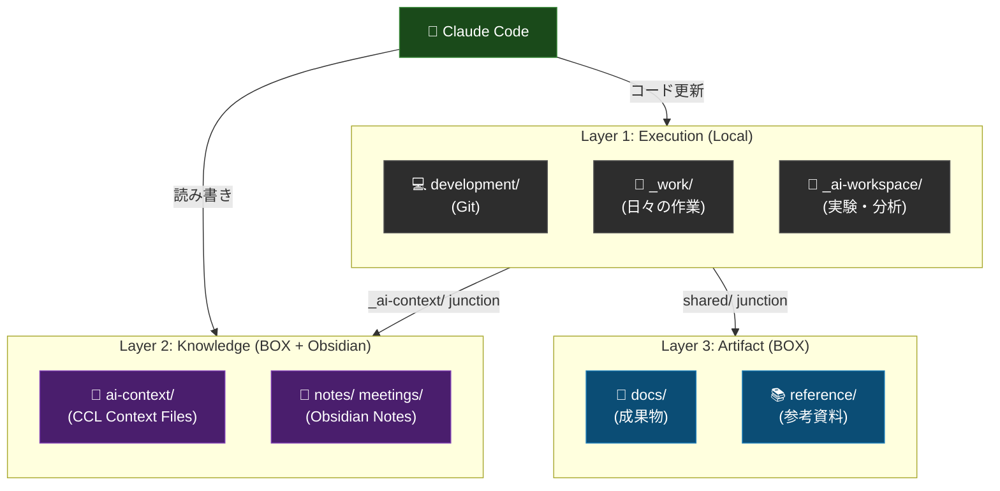

# ai-collab-folder-structure

AI (Claude Code) との協働を前提とした、プロジェクトフォルダ管理フレームワークです。
Windows + BOX Drive + Obsidian 環境で、複数プロジェクトのコンテキスト管理を自動化します。

> 🌐 [English version available here](README.md)


```mermaid
flowchart TD
    classDef local fill:#2d2d2d,stroke:#555,color:#fff
    classDef box fill:#0b4d75,stroke:#1a7bb9,color:#fff
    classDef obs fill:#4a1e6d,stroke:#7d3cb5,color:#fff
    classDef ai fill:#1a4a1a,stroke:#3a8a3a,color:#fff

    subgraph L1["Layer 1: Execution (Local)"]
        direction TB
        Dev["💻 development/\n(Git)"]:::local
        Work["📁 _work/\n(日々の作業)"]:::local
        AIW["🔬 _ai-workspace/\n(実験・分析)"]:::local
    end

    subgraph L3["Layer 3: Artifact (BOX)"]
        direction TB
        Docs["📄 docs/\n(成果物)"]:::box
        Ref["📚 reference/\n(参考資料)"]:::box
    end

    subgraph L2["Layer 2: Knowledge (BOX + Obsidian)"]
        direction TB
        CCL["🧠 ai-context/\n(CCL Context Files)"]:::obs
        Notes["📝 notes/ meetings/\n(Obsidian Notes)"]:::obs
    end

    Claude["🤖 Claude Code"]:::ai

    L1 -- "shared/ junction" --> L3
    L1 -- "_ai-context/ junction" --> L2
    Claude -- "読み書き" --> L2
    Claude -- "コード更新" --> L1
```

## なぜ使うのか

- AIがセッションをまたいで文脈を保持し、作業を継続できる (Context Compression Layer)
- Obsidian Vaultとの双方向連携で、過去の知見・議事録をAIが自動参照
- BOX Drive経由で複数PCにシームレスに同期
- GUIマネージャーでプロジェクトの作成・管理・アーカイブを一括操作

## ユースケース

### 続きから始める — 背景説明ゼロ

前回の作業内容を説明し直す必要はありません。`claude` を起動すると、AIが `current_focus.md` を読んで状況を把握し、すぐに続きから始められます。

> 🤖 前回は `auth.ts` のトークンリフレッシュ実装中でした。テストがまだ残っています。続けますか?

### 意思決定が自動的に記録される

技術選定や設計判断をした瞬間、AIが検知して記録を提案します。後から「あのとき何を決めたっけ?」という確認も `decision_log` を参照するだけです。

> 🤖 Redis をキャッシュレイヤーとして使う方針に決まりましたね。`decision_log` に記録しておきますか?

### 過去の知見をAIが参照する

Obsidianに蓄積した会議メモや技術メモをAIが自動で検索・参照します。「以前やった対処法」を自分で探す手間がなくなります。

> 👨‍💻 DBタイムアウトの設定ってどうだっけ?
> 🤖 `notes/db_timeout_config.md` (2026年1月) によると、コネクションプールの設定値は...

### 複数PCで同じ環境

自宅PCでもオフィスPCでも、BOX同期後に `claude` を起動するだけで同じコンテキストが読み込まれます。セットアップは GUIマネージャーの Setup タブを再実行するだけです。

## 前提・制約

- Windows専用 (ジャンクション・PowerShell)
- BOX Drive 必須 (Layer 2/3 の同期)

## 3層構造

| Layer | 役割 | 場所 | 特徴 |
|-------|------|------|------|
| Layer 1: Execution | 作業場 | Documents/Projects/{案件}/ | Git管理、揮発性 |
| Layer 2: Knowledge | 思考・知識 | Box/Obsidian-Vault/ | コンテキスト・知見蓄積 |
| Layer 3: Artifact | 成果物・参照 | Box/Projects/{案件}/ | BOX同期、バックアップ |

ローカルの `shared/` (→ Layer 3) と `_ai-context/` (→ Layer 2) をジャンクションで接続し、3層を透過的に扱えます。

## AI協働の仕組み (Context Compression Layer)

AIがセッションをまたいで文脈を引き継ぐためのコンテキスト管理層です。

| ファイル | 役割 | 目安サイズ |
|---------|------|-----------|
| `current_focus.md` | 今の作業フォーカス | 500トークン |
| `project_summary.md` | プロジェクト全体像 | 300トークン |
| `decision_log/` | 意思決定の履歴 | - |
| `tensions.md` | 未解決トレードオフ・懸念事項 | - |

AIはCLAUDE.mdの行動規範に従い、意思決定・セッション区切り・有益な知見を自律的に検知して記録提案します。ユーザーは普段の作業をするだけでOKです。

### Agent Skills

CCLを支える3つのスキルが CLAUDE.md に組み込まれ、AIが自律的に動作します。

#### context-decision-log

会話中の意思決定を自動検出し、構造化ログへの記録を提案します。
「○○にする」「○○で行こう」「○○はやめる」といった発言をトリガーに1行で提案。1セッション最大3回まで、作業の流れを止めません。

> 💡 Decision Logに記録しますか？ → DBはPostgreSQLを採用 (MySQLより運用実績が多い)

#### context-session-end

「今日はここまで」「ありがとう」などの区切りを検知し、`current_focus.md` への追記を提案します。
AIが関与した作業分のみを `[AI]` プレフィックスで追記し、人間が書いた行は一切変更しません。

> 📝 current_focus.md に追記しますか？
> + [AI] auth.ts のトークンリフレッシュ処理を実装
> + [AI] 認証フロー変更を Decision Log に記録

#### obsidian-knowledge

会話のトピックに関連するObsidianノートを自動検索して文脈補完します。
セッションで得た知見は `notes/` や `daily/` への保存を提案。プロジェクト横断で使える知見は `ai-context/tech-patterns/` や `lessons-learned/` へ振り分けます。

> 📓 Obsidianに記録しますか？ → notes/redis-cache-strategy.md
> Redis TTL設計とキー命名規則の調査結果

## プロジェクト Tier

| Tier | 用途 | 配置先 |
|------|------|--------|
| full / project | メイン案件 | `Projects/{案件}/` |
| mini / project | お手伝い・軽量案件 | `Projects/_mini/{案件}/` |
| full / domain | 継続的な技術領域 | `Projects/_domains/{案件}/` |
| mini / domain | 軽量な技術領域 | `Projects/_domains/_mini/{案件}/` |

`domain` は期間限定でない技術領域 (生成AIツール、共通基盤等) を `_domains/` 配下で管理するカテゴリです。
mini tier は `_ai-workspace/` を省略した軽量構成です。

## クイックスタート

### 1. paths.json を作成

`Documents/Projects/_config/paths.json`:

```json
{
  "localProjectsRoot": "%USERPROFILE%\\Documents\\Projects",
  "boxProjectsRoot": "%USERPROFILE%\\Box\\Projects",
  "obsidianVaultRoot": "%USERPROFILE%\\Box\\Obsidian-Vault",
  "hotkey": { "modifiers": "Ctrl+Shift", "key": "P" }
}
```

`hotkey` は省略可能 (デフォルト: Ctrl+Shift+P)。このファイルはBOX非同期のためPCごとに作成します。

### 2. GUIマネージャーを起動

`_exec_project_manager.cmd` をダブルクリック、またはグローバルホットキーで表示。

### 3. プロジェクトを作成

Setup タブでプロジェクト名と Tier を選択 → セットアップ実行。

### 4. 別PCでのセットアップ

BOX同期後、Setup タブから再実行するだけでジャンクションが再作成されます。

## GUIマネージャー機能

| タブ | 機能 |
|------|------|
| Dashboard | プロジェクト一覧 + 直近30日のActivity Bar + Today Queue (Asana Done対応) |
| Editor | AIコンテキストファイル・Asanaタスクへのクイックアクセス、Markdown編集 |
| Timeline | focus_history / decision_log から活動履歴を時系列表示 |
| Git Repos | プロジェクト別 Git リポジトリの一覧・管理 |
| Asana Sync | Asanaタスク → Markdown同期 (手動 / 定期自動) |
| Setup | プロジェクト作成・健全性チェック・アーカイブ・Tier変換 (サブタブ: New, Check, Archive, Convert) |
| Settings | ホットキー設定・Windowsスタートアップ登録 |

システムトレイ常駐 / グローバルホットキー / Catppuccin Mocha ダークテーマ

## 主要スクリプト

| スクリプト | 用途 |
|-----------|------|
| `project_manager.ps1` | GUIマネージャー本体 |
| `setup_project.ps1` | プロジェクト初期セットアップ |
| `setup_context_layer.ps1` | CCL セットアップ |
| `check_project.ps1` | 健全性チェック |
| `archive_project.ps1` | アーカイブ |
| `convert_tier.ps1` | Tier変換 (mini <-> full) |
| `sync_from_asana.py` | Asana → Markdown同期 |

## 関連ドキュメント

- [workspace-architecture.md](./workspace-architecture.md) - 詳細設計ドキュメント
- [_projectTemplate/README.md](./Projects/_projectTemplate/README.md) - テンプレート詳細
- [context-compression-layer/README-ja.md](./Projects/_projectTemplate/context-compression-layer/README-ja.md) - CCL詳細

## License

MIT License
