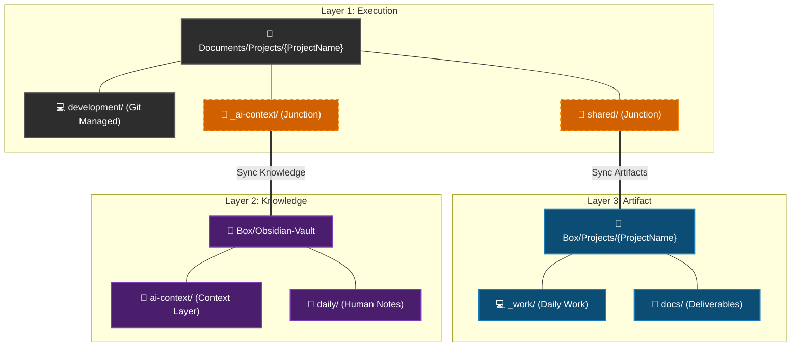
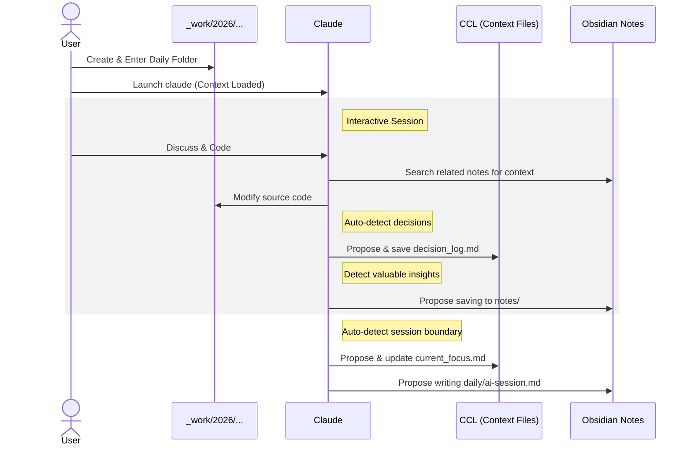

# ai-collab-folder-structure

<!--  -->

> 🌐 [日本語版はこちら / Japanese version available here](README-ja.md)

A project folder management framework designed for collaboration with AI (Claude Code).

## Overview

A three-layer workspace structure for organizing multiple projects and optimizing context sharing with AI.

- Layer 1 (Execution): Local workspace (Git-managed, volatile work)
- Layer 2 (Knowledge): Obsidian Vault (accumulation of thoughts and insights, BOX sync)
- Layer 3 (Artifact): Deliverables and reference materials (file backup and cross-PC sync, BOX sync)

## Three-Layer Structure



| Layer | Role | Location | Data Characteristics |
|-------|------|----------|---------------------|
| Layer 1: Execution | Workspace | Documents/Projects/{Project}/ (Local) | WIP, highly volatile |
| Layer 2: Knowledge | Thinking & Knowledge | Box/Obsidian-Vault/ (BOX Sync) | Context, history, insights |
| Layer 3: Artifact | Deliverables & References | Box/Projects/{Project}/ (BOX Sync) | Backup and cross-PC sync documents |

## AI Collaboration Workflow

This architecture integrates the Context Compression Layer (CCL) and autonomous AI behavioral guidelines as core features, enabling seamless collaboration where the AI naturally manages context without requiring explicit skill invocation from the user.

### Context Compression Layer (CCL)

AI context management across sessions - ensuring the AI correctly understands past context and maintains continuous workflow:

- Components: project_summary.md (overview), current_focus.md (current focus), decision_log (history of decisions)
- Auto-loading: `AGENTS.md` loads CCL content at session start (alias files like `CLAUDE.md` for each CLI tool reference the same content)
- Autonomous behavior: The AI detects decisions and work boundaries from conversation flow and proactively proposes context file updates

### Autonomous AI Behavioral Guidelines

The AI follows behavioral guidelines defined in CLAUDE.md and autonomously executes the following. Users do not need to be aware of or explicitly invoke skill names.

- Decision detection and recording: Detects implicit decisions (technology selection, design judgments, etc.) during conversation and proposes recording them as structured decision logs
- Session boundary detection: Naturally detects work boundaries and proposes appending only AI-contributed work to `current_focus.md`
- Obsidian knowledge integration: Reads `_ai-context/obsidian_notes/` to enrich context from past notes, and proposes writing session outcomes and valuable insights back to the Obsidian Vault (attaching the `#ai-memory` tag to notes generated by AI)

### Workflow Example (Claude Code)

Daily tasks are performed within the BOX-synced `_work` folder, organized by date-based working directories.
The AI autonomously manages context according to its behavioral guidelines, so users don't need to be aware of skills during everyday work.



#### 1. Create and Navigate to Work Folder

```bash
# Create and navigate to a date-based dedicated working folder
cd Box\Projects\NewProject\_work
mkdir 2026\202602_feature_x
cd 2026\202602_feature_x

# Launch Claude Code (project context is automatically loaded)
claude
```

#### 2. Working with Claude Code (AI Records Autonomously)

Users simply proceed with their normal work, and the AI evaluates the situation to propose recording at appropriate moments.

👨‍💻 User:
Improve the login process in `src/api/auth.ts`. Let's add a token refresh mechanism when the token expires.

🤖 Claude:
(After modifying the code...)
The updates are complete.
💡 Record in Decision Log? → Added token refresh to authentication flow

👨‍💻 User:
Yes, please.

🤖 Claude:
Recorded in `decision_log.md`.

👨‍💻 User:
That's all for today.

🤖 Claude:
📝 Append to current_focus.md?

Add to [Recent events]:
  + [AI] Implemented token refresh in auth.ts
  + [AI] Recorded auth flow change in Decision Log

(Yes / Modify / Not needed)

#### 3. Obsidian Knowledge Integration (AI and Vault in Sync)

The AI reads and writes to the Obsidian Vault through `_ai-context/obsidian_notes/`, accumulating technical insights and session outcomes.

👨‍💻 User:
How did we configure the DB connection timeout when we fixed that issue previously in this project?

🤖 Claude:
Searched `obsidian_notes/notes/`.
According to `db_timeout_config.md` recorded in Jan 2026, the connection pool settings were...

👨‍💻 User:
I see, thanks. I'd like to implement the token refresh based on what we decided in last week's authentication review meeting.

🤖 Claude:
Let me check `obsidian_notes/meetings/`.
Found `2026-02-17_authentication-review.md`. Key decisions were...
(Proposes implementation approach based on the notes)

👨‍💻 User:
Perfect, let's go with that. That's all for today.

🤖 Claude:
📝 Append to current_focus.md?

Add to [Recent events]:
  + [AI] Implemented token refresh in auth.ts

📓 The Redis caching strategy from this session seems worth referencing in the future. Save to Obsidian?
→ notes/redis-cache-strategy.md
  Redis cache strategy: TTL design and key naming conventions

(Yes / Modify / Not needed)

#### 4. Benefits of this Workflow

By working within the `_work` folder in this manner, you gain the following benefits:
- Work-in-progress files (e.g., temporary outputs) do not clutter the formal documents in `docs`
- Only important decisions (`decision_log.md`) and progress (`current_focus.md`) are automatically extracted and recorded through the AI's autonomous judgment
- When you resume work next time, the AI loads the updated `current_focus.md`, allowing for a seamless restart
- The AI references past meeting notes and insights from the Obsidian Vault for context, reducing the need to re-explain background
- AI session outcomes accumulate in the Obsidian Vault, growing the project knowledge base over time

## Detailed Workspace Architecture

### Two Project Tiers

| Tier | Location | Purpose | Structure |
|------|----------|---------|-----------|
| full | `Projects/{Project}/` | Main projects | Full features (_ai-workspace, structured folders) |
| mini | `Projects/_mini/{Project}/` | Support tasks | Minimal (mini folders) |

### Multi-CLI Support

This architecture supports environments where multiple AI CLI agents (Claude Code, Codex CLI, Gemini CLI, etc.) coexist, with a unified approach to instructions and context. The master instruction file is maintained as a single `shared/AGENTS.md` (Layer 3), and copies are placed with the filenames required by each CLI tool (`CLAUDE.md`, etc.). See [workspace-architecture.md](./workspace-architecture.md) for details.

### Sync Strategy Between 2 PCs

- BOX sync: Obsidian Vault, deliverables via shared/
- Git sync: Source code (development/source/)
- Local independent: _ai-workspace/

### Overall Workspace Structure

```
Documents/Projects/
├── _config/
│   └── paths.json              # Workspace common path definitions
├── _projectTemplate/           # Project template and management scripts
│   ├── scripts/
│   │   ├── project_manager.ps1     # GUI project manager
│   │   ├── setup_project.ps1       # Project initial setup
│   │   ├── check_project.ps1       # Health check
│   │   ├── archive_project.ps1     # Archive completed projects
│   │   ├── config.template.json    # Config file template
│   │   └── manager/                   # GUI manager modules
├── exec_project_manager.cmd       # GUI manager batch (Projects root)
│   ├── context-compression-layer/  # AI Context Compression Layer setup
│   │   ├── setup_context_layer.ps1 # Context layer setup script
│   │   ├── templates/              # Context file templates
│   │   ├── examples/               # Usage examples
│   │   ├── skills/                 # Agent skills for context management
│   │   ├── README.md               # English documentation
│   │   └── README-ja.md            # Japanese documentation
│   ├── AGENTS.md               # AI instructions template for new projects
│   ├── CLAUDE.md               # AGENTS.md copy (for Claude CLI)
│   └── README.md               # Template detailed documentation
├── _globalScripts/             # Cross-project scripts
│   ├── sync_from_asana.py      # Asana → Markdown sync
│   └── config.json.example     # Asana sync config example
├── _archive/                   # Archived projects
│   └── _mini/               # Archived mini tier projects
├── _mini/                   # Mini tier projects
├── .context/                   # Workspace-level AI context
│   └── active_projects.md      # Active projects list
├── _ai-workspace/              # AI analysis and experimentation for entire workspace
├── CLAUDE.md                   # AI instructions for entire workspace
├── README.md                   # This file
├── workspace-architecture.md   # Detailed design documentation
└── {ProjectName}/              # Individual projects (full tier)
```

### Project Folder Structure

#### Full Tier

```
Documents/Projects/{ProjectName}/
├── _ai-context/                # AI Context & Obsidian Junction [Local]
│   └── obsidian_notes/         # Junction → Box/Obsidian-Vault/Projects/{ProjectName}
├── _ai-workspace/              # AI analysis and experimentation [Local]
├── development/                # Development related [Local - Git managed]
│   ├── source/                 # Source code
│   ├── config/                 # Configuration files
│   └── scripts/                # Development scripts
├── shared/                     # Junction → Box/Projects/{ProjectName}
├── external_shared/            # (Optional) Directory containing junctions to arbitrary BOX folders
├── AGENTS.md                   # Copy from shared/AGENTS.md
└── CLAUDE.md                   # Copy from shared/AGENTS.md

Box/Projects/{ProjectName}/
├── CLAUDE.md                   # AI instructions (physical file)
├── docs/                       # Created/edited documents
│   ├── planning/               # Planning, requirements, proposals
│   ├── design/                 # Design documents
│   ├── testing/                # Test plans, cases, results
│   └── release/                # Release and migration procedures
├── reference/                  # Reference materials (read-only, for storage)
│   ├── vendor/                 # Vendor-provided materials
│   ├── standards/              # Company rules and standards
│   └── external/               # Other external materials
├── records/                    # Records and history (evidence)
│   ├── minutes/                # Meeting minutes
│   ├── reports/                # Progress reports
│   └── reviews/                # Review records
└── _work/                      # Date-based working folders
```

#### Mini Tier

```
Documents/Projects/_mini/{ProjectName}/
├── _ai-context/                # AI Context & Obsidian Junction [Local]
│   └── obsidian_notes/         # Junction → Box/Obsidian-Vault/Projects/_mini/{ProjectName}
├── development/                # Development related [Local]
│   ├── source/                 # Source code (Git managed)
│   └── config/                 # Configuration files
├── shared/                     # Junction → Box/Projects/_mini/{ProjectName}
├── AGENTS.md                   # Copy from shared/AGENTS.md
└── CLAUDE.md                   # Copy from shared/AGENTS.md

Box/Projects/_mini/{ProjectName}/
├── CLAUDE.md                   # AI instructions (physical file)
├── docs/                       # Documents (flat - no subfolders)
└── _work/                      # Working folder
```

### Link Configuration

| Type | Local Side | Link Destination (BOX Side) | Admin Rights |
|------|-----------|----------------------------|-------------|
| Junction | shared/ | Box/Projects/{ProjectName}/ | Not required |
| Junction | _ai-context/obsidian_notes/ | Box/Obsidian-Vault/Projects/{ProjectName}/ | Not required |
| Junction | external_shared/ | User's specified BOX Folder | Not required |

## Quick Start

### 1. Prerequisites

Create `Documents/Projects/_config/paths.json`:

```json
{
  "localProjectsRoot": "%USERPROFILE%\\Documents\\Projects",
  "boxProjectsRoot": "%USERPROFILE%\\Box\\Projects",
  "obsidianVaultRoot": "%USERPROFILE%\\Box\\Obsidian-Vault"
}
```

Each value is a full path. Environment variables such as `%USERPROFILE%` are expanded automatically.

### 2. Using GUI Manager

```powershell
powershell -ExecutionPolicy Bypass -File "%USERPROFILE%\Documents\Projects\_projectTemplate\scripts\project_manager.ps1"
```

Or double-click `exec_project_manager.cmd` in the Projects root to launch.

Features:
- Dashboard tab: Project overview with quick actions
- Editor tab: Built-in file viewer/editor for project files
- Setup tab: Select project name and Tier for setup
- AI Context tab: Set up Context Compression Layer for projects
- Check tab: Health check for existing projects
- Archive tab: Archive with DryRun preview
- Archiving moves all three layers to `_archive/`. Mini tier projects are moved under `_archive/_mini/`.
- Real-time display of script output
- Custom dark-themed title bar (Catppuccin Mocha)

### 3. Setup on PC-B

After BOX sync is complete, simply run the setup from the GUI Manager's Setup tab again to create junctions.

- The `_config/paths.json` file needs to be created on each PC individually (Not synced via BOX).
- CLAUDE.md/AGENTS.md copies are created automatically.

## Script List

### _projectTemplate/scripts/

| Script | Purpose |
|--------|---------|
| `project_manager.ps1` | GUI project manager (integrates all scripts) |
| `setup_project.ps1` | Project initial setup |
| `check_project.ps1` | Health check |
| `archive_project.ps1` | Archive completed projects |
| `convert_tier.ps1` | Convert between mini/full tiers |
| `config.template.json` | Config file template |
| `exec_project_manager.cmd` | GUI manager batch file (in Projects root) |

### context-compression-layer/

| File | Purpose |
|------|---------|
| `setup_context_layer.ps1` | Set up Context Compression Layer for a project (auto-appends CCL instructions to CLAUDE.md) |
| `save_focus_snapshot.ps1` | Save daily snapshot of current_focus.md |
| `templates/` | Template files for AI context (project_summary, current_focus, file_map, decision_log, etc.) |
| `templates/CLAUDE_MD_SNIPPET.md` | CCL instructions to append to CLAUDE.md |
| `examples/` | Example files showing usage patterns |
| `skills/` | AI autonomous behavioral guidelines |
| `skills/context-decision-log/` | Auto-detect decisions and record structured logs |
| `skills/context-session-end/` | Detect session boundaries and update current_focus.md |
| `skills/obsidian-knowledge/` | Read Obsidian Vault for context and propose writing session outcomes back |

### _globalScripts/

| Script | Purpose |
|--------|---------|
| `sync_from_asana.py` | Asana tasks → Markdown sync |
| `config.json.example` | Asana sync config file example |

## Documentation

- [workspace-architecture.md](./workspace-architecture.md) - Detailed design documentation
- [_projectTemplate/README.md](./Projects/_projectTemplate/README.md) - Template detailed documentation
- [CLAUDE.md](./Projects/CLAUDE.md) - AI instructions for entire workspace

## Limitations

- Windows only (junctions and PowerShell scripts)
- BOX Drive required (Layer 2/3 sync)
- Junctions only work within the same volume

## License

MIT License
