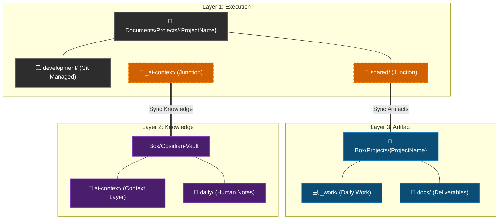
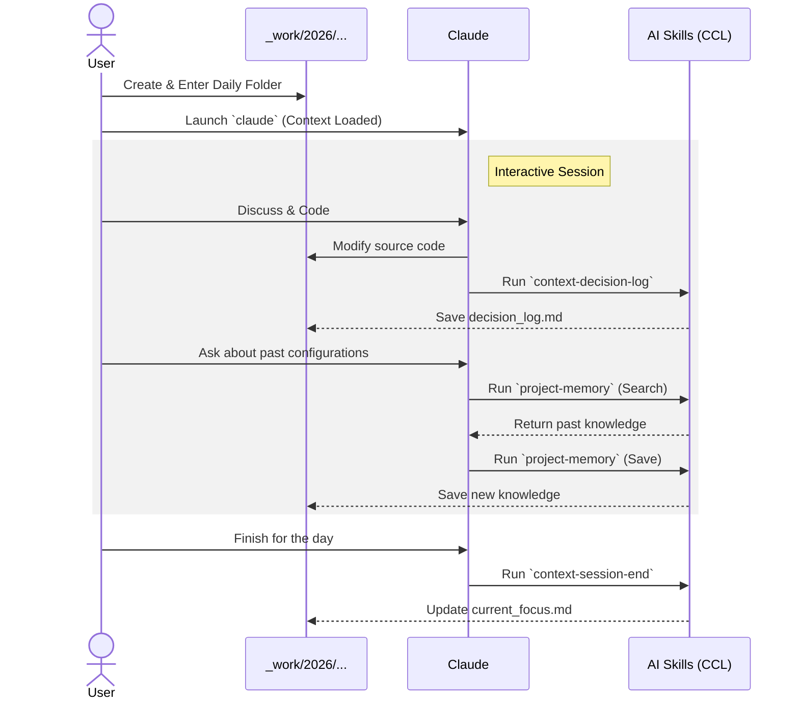

# ai-collab-folder-structure

<!--  -->

> 🌐 [日本語版はこちら / Japanese version available here](README-ja.md)

A project folder management framework designed for collaboration with AI (Claude Code).

## Overview

A three-layer workspace structure for organizing multiple projects and optimizing context sharing with AI.

- Layer 1 (Execution): Local workspace (Git-managed, volatile work)
- Layer 2 (Knowledge): Obsidian Vault (accumulation of thoughts and insights, BOX sync)
- Layer 3 (Artifact): Deliverables and reference materials (file backup and cross-PC sync, BOX sync)

## Three-Layer Structure



| Layer | Role | Location | Data Characteristics |
|-------|------|----------|---------------------|
| Layer 1: Execution | Workspace | Documents/Projects/{Project}/ (Local) | WIP, highly volatile |
| Layer 2: Knowledge | Thinking & Knowledge | Box/Obsidian-Vault/ (BOX Sync) | Context, history, insights |
| Layer 3: Artifact | Deliverables & References | Box/Projects/{Project}/ (BOX Sync) | Backup and cross-PC sync documents |

## AI Collaboration Workflow

This architecture integrates SKILLs (AI agent extensions) and the Context Compression Layer (CCL) to enable seamless collaboration with AI.

### Context Compression Layer (CCL)

AI context management across sessions - ensuring the AI correctly understands past context and maintains continuous workflow:

- Components: project_summary.md (overview), current_focus.md (current focus), decision_log (history of decisions), memories (project memory).
- Auto-loading: `AGENTS.md` (or `CLAUDE.md`) is designed to automatically read CCL files at session start.

### Custom AI Skills

Custom Skills empower the AI to autonomously manage project context and memory.

- `context-decision-log`: Detects implicit decisions during work and proposes recording them as structured logs.
- `context-session-end`: Proposes appending the AI's recent contributions to `current_focus.md` at work boundaries.
- `project-memory`: A project-specific knowledge base where the AI records and searches for valuable technical insights.

### Workflow Example (Claude Code)

Daily tasks are performed within the BOX-synced `_work` folder, organized by date-based working directories.
By leveraging Claude Code and custom AI Skills (SKILLs), you can work efficiently without losing context.



#### 1. Create and Navigate to Work Folder

```bash
# Create and navigate to a date-based dedicated working folder
cd Box\Projects\NewProject\_work
mkdir 2026\202602_feature_x
cd 2026\202602_feature_x

# Launch Claude Code (project context is automatically loaded)
claude
```

#### 2. Working with Claude Code (Using SKILLs)

As you work, the AI autonomously evaluates the situation and proposes executing appropriate SKILLs at the right time.

👨‍💻 User:
```
Improve the login process in `src/api/auth.ts`. Let's add a token refresh mechanism when the token expires.
```

🤖 Claude:
```
(After modifying the code...)
The updates are complete.
Since this implementation change affects the architecture, shall I record this in the decision log using the `context-decision-log` skill?
```

👨‍💻 User:
```
Yes, please.
```

🤖 Claude:
```
(Executes the `context-decision-log` skill and records "Added token refresh process" in `decision_log.md`)
```

👨‍💻 User:
```
That's all for today.
```

🤖 Claude:
```
Understood. Before ending the session, shall I use the `context-session-end` skill to append today's progress (login process improvements) to `current_focus.md`?
```

👨‍💻 User:
```
Yes, go ahead.
```

#### 3. Leveraging Project Memory (`project-memory`)

The SKILL also shines when preserving new discoveries or recalling past knowledge specifically for the project (both Search and Record).

👨‍💻 User:
```
How did we configure the DB connection timeout when we fixed that issue previously in this project?
```

🤖 Claude:
```
(Executes the `project-memory` skill to search...)
I found the relevant knowledge in the project memory.
According to `db_timeout_config.md` recorded in Jan 2026, the connection pool settings were...
```

👨‍💻 User:
```
I see, thanks. By the way, the Redis caching strategy we just added seems like something we'll need to reference later. Please save it.
```

🤖 Claude:
```
Understood. I will use the `project-memory` skill to record our new Redis caching strategy as `redis_cache_strategy.md` in the project memory.
```

#### 4. Benefits of this Workflow

By working within the `_work` folder in this manner, you gain the following benefits:
- Work-in-progress files (e.g., temporary outputs) do not clutter the formal documents in `docs`
- Only verified, important decisions (`decision_log.md`) and progress (`current_focus.md`) are automatically extracted and recorded via AI Skills
- When you resume work next time, the AI loads the updated `current_focus.md`, allowing for a seamless restart

## Detailed Workspace Architecture

### Two Project Tiers

| Tier | Location | Purpose | Structure |
|------|----------|---------|-----------|
| full | `Projects/{Project}/` | Main projects | Full features (_ai-workspace, structured folders) |
| mini | `Projects/_mini/{Project}/` | Support tasks | Minimal (mini folders) |

### Structure Options for Full Tier

For full tier, you can choose between two document structures on the BOX side (Layer 3):

| Structure | Description |
|-----------|-------------|
| new (default) | Purpose-based classification (docs/reference/records) |
| legacy | Phase number-based (01_planning ~ 10_reference) |

### Sync Strategy Between 2 PCs

- BOX sync: Obsidian Vault, deliverables via shared/
- Git sync: Source code (development/source/)
- Local independent: _ai-workspace/

### Overall Workspace Structure

```
Documents/Projects/
├── _config/
│   └── paths.json              # Workspace common path definitions
├── _projectTemplate/           # Project template and management scripts
│   ├── scripts/
│   │   ├── project_manager.ps1     # GUI project manager
│   │   ├── setup_project.ps1       # Project initial setup
│   │   ├── check_project.ps1       # Health check
│   │   ├── archive_project.ps1     # Archive completed projects
│   │   ├── config.template.json    # Config file template
│   │   └── manager/                   # GUI manager modules
├── exec_project_manager.cmd       # GUI manager batch (Projects root)
│   ├── context-compression-layer/  # AI Context Compression Layer setup
│   │   ├── setup_context_layer.ps1 # Context layer setup script
│   │   ├── templates/              # Context file templates
│   │   ├── examples/               # Usage examples
│   │   ├── skills/                 # Agent skills for context management
│   │   ├── README.md               # English documentation
│   │   └── README-ja.md            # Japanese documentation
│   ├── AGENTS.md               # AI instructions template for new projects
│   ├── CLAUDE.md               # AGENTS.md copy (for Claude CLI)
│   └── README.md               # Template detailed documentation
├── _globalScripts/             # Cross-project scripts
│   ├── sync_from_asana.py      # Asana → Markdown sync
│   └── config.json.example     # Asana sync config example
├── _archive/                   # Archived projects
│   └── _mini/               # Archived mini tier projects
├── _mini/                   # Mini tier projects
├── .context/                   # Workspace-level AI context
│   └── active_projects.md      # Active projects list
├── _ai-workspace/              # AI analysis and experimentation for entire workspace
├── CLAUDE.md                   # AI instructions for entire workspace
├── README.md                   # This file
├── workspace-architecture.md   # Detailed design documentation
└── {ProjectName}/              # Individual projects (full tier)
```

### Project Folder Structure

#### Full Tier

```
Documents/Projects/{ProjectName}/
├── _ai-context/                # AI Context & Obsidian Junction [Local]
│   └── obsidian_notes/         # Junction → Box/Obsidian-Vault/Projects/{ProjectName}
├── _ai-workspace/              # AI analysis and experimentation [Local]
├── development/                # Development related [Local - Git managed]
│   ├── source/                 # Source code
│   ├── config/                 # Configuration files
│   └── scripts/                # Development scripts
├── shared/                     # Junction → Box/Projects/{ProjectName}
├── AGENTS.md                   # Copy from shared/AGENTS.md
└── CLAUDE.md                   # Copy from shared/AGENTS.md

Box/Projects/{ProjectName}/         (new structure)
├── CLAUDE.md                   # AI instructions (physical file)
├── docs/                       # Created/edited documents
│   ├── planning/               # Planning, requirements, proposals
│   ├── design/                 # Design documents
│   ├── testing/                # Test plans, cases, results
│   └── release/                # Release and migration procedures
├── reference/                  # Reference materials (read-only, for storage)
│   ├── vendor/                 # Vendor-provided materials
│   ├── standards/              # Company rules and standards
│   └── external/               # Other external materials
├── records/                    # Records and history (evidence)
│   ├── minutes/                # Meeting minutes
│   ├── reports/                # Progress reports
│   └── reviews/                # Review records
└── _work/                      # Date-based working folders
```

#### Mini Tier

```
Documents/Projects/_mini/{ProjectName}/
├── _ai-context/                # AI Context & Obsidian Junction [Local]
│   └── obsidian_notes/         # Junction → Box/Obsidian-Vault/Projects/_mini/{ProjectName}
├── development/                # Development related [Local]
│   ├── source/                 # Source code (Git managed)
│   └── config/                 # Configuration files
├── shared/                     # Junction → Box/Projects/_mini/{ProjectName}
├── AGENTS.md                   # Copy from shared/AGENTS.md
└── CLAUDE.md                   # Copy from shared/AGENTS.md

Box/Projects/_mini/{ProjectName}/
├── CLAUDE.md                   # AI instructions (physical file)
├── docs/                       # Documents (flat - no subfolders)
└── _work/                      # Working folder
```

### Link Configuration

| Type | Local Side | Link Destination (BOX Side) | Admin Rights |
|------|-----------|----------------------------|-------------|
| Junction | shared/ | Box/Projects/{ProjectName}/ | Not required |
| Junction | _ai-context/obsidian_notes/ | Box/Obsidian-Vault/Projects/{ProjectName}/ | Not required |

## Quick Start

### 1. Prerequisites

Create `Documents/Projects/_config/paths.json`:

```json
{
  "localProjectsRoot": "Documents\\Projects",
  "boxProjectsRoot": "Box\\Projects",
  "obsidianVaultRoot": "Box\\Obsidian-Vault"
}
```

Each value is a relative path from `%USERPROFILE%`.

### 2. Using GUI Manager (Recommended)

```powershell
powershell -ExecutionPolicy Bypass -File "%USERPROFILE%\Documents\Projects\_projectTemplate\scripts\project_manager.ps1"
```

Or double-click `exec_project_manager.cmd` in the Projects root to launch.

Features:
- Dashboard tab: Project overview with quick actions
- Editor tab: Built-in file viewer/editor for project files
- Setup tab: Select project name, Structure, and Tier for setup
- AI Context tab: Set up Context Compression Layer for projects
- Check tab: Health check for existing projects
- Archive tab: Archive with DryRun preview
- Real-time display of script output
- Custom dark-themed title bar (Catppuccin Mocha)

### 3. Command Line Operation

```powershell
# Main project (full tier, new structure - default)
.\_projectTemplate\scripts\setup_project.ps1 -ProjectName "NewProject"

# Main project (full tier, legacy structure)
.\_projectTemplate\scripts\setup_project.ps1 -ProjectName "NewProject" -Structure legacy

# Support task (mini tier)
.\_projectTemplate\scripts\setup_project.ps1 -ProjectName "SupportProject" -Tier mini
```

### 4. Health Check

```powershell
# Main project
.\_projectTemplate\scripts\check_project.ps1 -ProjectName "NewProject"

# Support task
.\_projectTemplate\scripts\check_project.ps1 -ProjectName "SupportProject" -Mini
```

### 5. Archiving Projects

```powershell
# Check with DryRun (no actual changes)
.\_projectTemplate\scripts\archive_project.ps1 -ProjectName "MyProject" -DryRun

# Execute
.\_projectTemplate\scripts\archive_project.ps1 -ProjectName "MyProject"

# Support task
.\_projectTemplate\scripts\archive_project.ps1 -ProjectName "SupportProject" -Mini -DryRun
```

Archiving moves all three layers to `_archive/`. Mini tier projects are moved under `_archive/_mini/`.

### 6. Setup on PC-B

After BOX sync is complete, simply run the same script to create junctions and symbolic links:

```powershell
.\_projectTemplate\scripts\setup_project.ps1 -ProjectName "NewProject"
```

- CLAUDE.md/AGENTS.md copies are created automatically by the script.

## Script List

### _projectTemplate/scripts/

| Script | Purpose |
|--------|---------|
| `project_manager.ps1` | GUI project manager (integrates all scripts) |
| `setup_project.ps1` | Project initial setup |
| `check_project.ps1` | Health check |
| `archive_project.ps1` | Archive completed projects |
| `convert_tier.ps1` | Convert between mini/full tiers |
| `config.template.json` | Config file template |
| `exec_project_manager.cmd` | GUI manager batch file (in Projects root) |

### context-compression-layer/

| File | Purpose |
|------|---------|
| `setup_context_layer.ps1` | Set up Context Compression Layer for a project (auto-appends CCL instructions to CLAUDE.md) |
| `save_focus_snapshot.ps1` | Save daily snapshot of current_focus.md |
| `templates/` | Template files for AI context (project_summary, current_focus, file_map, decision_log, etc.) |
| `templates/CLAUDE_MD_SNIPPET.md` | CCL instructions to append to CLAUDE.md |
| `examples/` | Example files showing usage patterns |
| `skills/` | AI Agent skills for context management |
| `skills/context-decision-log/` | Record structured decision logs, detect implicit decisions |
| `skills/context-session-end/` | Propose appending AI contributions to current_focus.md |
| `skills/project-memory/` | Project-specific memory for saving discoveries and searching |

### _globalScripts/

| Script | Purpose |
|--------|---------|
| `sync_from_asana.py` | Asana tasks → Markdown sync |
| `config.json.example` | Asana sync config file example |

## Documentation

- [workspace-architecture.md](./workspace-architecture.md) - Detailed design documentation
- [_projectTemplate/README.md](./Projects/_projectTemplate/README.md) - Template detailed documentation
- [CLAUDE.md](./Projects/CLAUDE.md) - AI instructions for entire workspace

## Limitations

- Windows only (junctions and PowerShell scripts)
- BOX Drive required (Layer 2/3 sync)
- Junctions only work within the same volume
- .ps1 scripts are written in Shift_JIS (cp932), output is UTF-8
- Obsidian Vault should not be opened on two PCs simultaneously (to prevent data overwrite)

## License

MIT License
