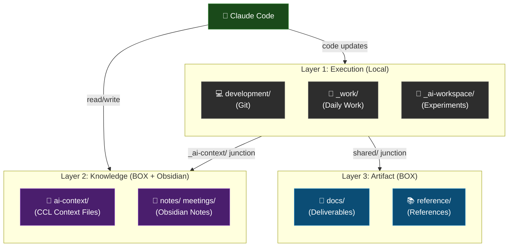

# ai-collab-folder-structure

A project folder management framework designed for collaboration with AI (Claude Code).
Automates context management across multiple projects in a Windows + BOX Drive + Obsidian environment.

> 🌐 [日本語版はこちら / Japanese version available here](README-ja.md)


```mermaid
flowchart TD
    classDef local fill:#2d2d2d,stroke:#555,color:#fff
    classDef box fill:#0b4d75,stroke:#1a7bb9,color:#fff
    classDef obs fill:#4a1e6d,stroke:#7d3cb5,color:#fff
    classDef ai fill:#1a4a1a,stroke:#3a8a3a,color:#fff

    subgraph L1["Layer 1: Execution (Local)"]
        direction TB
        Dev["💻 development/\n(Git)"]:::local
        Work["📁 _work/\n(Daily Work)"]:::local
        AIW["🔬 _ai-workspace/\n(Experiments)"]:::local
    end

    subgraph L3["Layer 3: Artifact (BOX)"]
        direction TB
        Docs["📄 docs/\n(Deliverables)"]:::box
        Ref["📚 reference/\n(References)"]:::box
    end

    subgraph L2["Layer 2: Knowledge (BOX + Obsidian)"]
        direction TB
        CCL["🧠 ai-context/\n(CCL Context Files)"]:::obs
        Notes["📝 notes/ meetings/\n(Obsidian Notes)"]:::obs
    end

    Claude["🤖 Claude Code"]:::ai

    L1 -- "shared/ junction" --> L3
    L1 -- "_ai-context/ junction" --> L2
    Claude -- "read/write" --> L2
    Claude -- "code updates" --> L1
```

## Why use this?

- AI retains context across sessions for continuous workflow (Context Compression Layer)
- Bidirectional Obsidian Vault integration — AI auto-references past notes and meeting records
- Seamless multi-PC sync via BOX Drive
- GUI Manager for creating, managing, and archiving projects in one place

## Use Cases

### Pick up where you left off — zero re-explanation

No need to re-explain background context. When you launch `claude`, the AI reads `current_focus.md` and gets right back to where you were.

> 🤖 Last session you were mid-way through implementing token refresh in `auth.ts`. Tests are still pending — shall we continue?

### Decisions get recorded automatically

The moment you make a technical or design decision, the AI detects it and proposes logging it. No more wondering "what did we decide on that again?"

> 🤖 Looks like we settled on Redis as the caching layer. Want me to log this in `decision_log`?

### AI references your past knowledge

The AI searches and references meeting notes and technical memos stored in Obsidian. No more digging through old notes yourself.

> 👨‍💻 How did we configure the DB timeout before?
> 🤖 According to `notes/db_timeout_config.md` (January 2026), the connection pool settings were...

### Same environment across multiple PCs

Whether at the office or at home, just run `claude` after BOX sync completes — the same context loads automatically. Re-setup is a single click in the GUI Manager's Setup tab.

## Requirements & Limitations

- Windows only (junctions and PowerShell scripts)
- BOX Drive required (Layer 2/3 sync)

## Three-Layer Structure

| Layer | Role | Location | Characteristics |
|-------|------|----------|----------------|
| Layer 1: Execution | Workspace | Documents/Projects/{Project}/ | Git-managed, volatile |
| Layer 2: Knowledge | Thinking & Knowledge | Box/Obsidian-Vault/ | Context, history, insights |
| Layer 3: Artifact | Deliverables & References | Box/Projects/{Project}/ | BOX sync, backup |

Local `shared/` (→ Layer 3) and `_ai-context/` (→ Layer 2) are connected via junctions, making all three layers transparently accessible.

## AI Collaboration (Context Compression Layer)

A context management layer that allows AI to carry over context across sessions.

| File | Role | Target Size |
|------|------|-------------|
| `current_focus.md` | Current work focus | ~500 tokens |
| `project_summary.md` | Project overview | ~300 tokens |
| `decision_log/` | Decision history | - |
| `tensions.md` | Unresolved trade-offs and concerns | - |

The AI autonomously detects decisions, session boundaries, and valuable insights during conversation — and proposes recording them. Users simply work as usual.

### Agent Skills

Three skills are embedded in CLAUDE.md and drive the AI's autonomous behavior.

#### context-decision-log

Monitors conversation for decision patterns ("let's go with X", "we'll use Y", "drop Z") and proposes a structured log entry in one line — without interrupting the flow. Up to 3 proposals per session.

> 💡 Log to Decision Log? → Adopting PostgreSQL over MySQL (better operational track record)

#### context-session-end

Detects natural session boundaries ("that's it for today", "thanks") and proposes appending to `current_focus.md`. Only AI-contributed work is added, prefixed with `[AI]`. Human-authored lines are never touched.

> 📝 Append to current_focus.md?
> + [AI] Implemented token refresh in auth.ts
> + [AI] Logged auth flow change in Decision Log

#### obsidian-knowledge

Auto-searches Obsidian notes for topics that come up in conversation, enriching context without being asked. After a session, proposes saving insights to `notes/` or `daily/`. Cross-project findings are routed to `ai-context/tech-patterns/` or `lessons-learned/`.

> 📓 Save to Obsidian? → notes/redis-cache-strategy.md
> Redis TTL design and key naming conventions

## Project Tiers

| Tier | Use Case | Location |
|------|----------|----------|
| full / project | Main projects | `Projects/{Project}/` |
| mini / project | Support tasks (lightweight) | `Projects/_mini/{Project}/` |
| full / domain | Ongoing technical domains | `Projects/_domains/{Project}/` |
| mini / domain | Lightweight domain tasks | `Projects/_domains/_mini/{Project}/` |

`domain` is for ongoing technical areas (e.g., GenAI tooling, shared platform) managed separately under `_domains/`.
mini tier omits `_ai-workspace/` for a lighter footprint.

## Quick Start

### 1. Create paths.json

`Documents/Projects/_config/paths.json`:

```json
{
  "localProjectsRoot": "%USERPROFILE%\\Documents\\Projects",
  "boxProjectsRoot": "%USERPROFILE%\\Box\\Projects",
  "obsidianVaultRoot": "%USERPROFILE%\\Box\\Obsidian-Vault",
  "hotkey": { "modifiers": "Ctrl+Shift", "key": "P" }
}
```

`hotkey` is optional (defaults to Ctrl+Shift+P). This file is not BOX-synced — create it on each PC individually.

### 2. Launch the GUI Manager

Double-click `exec_project_manager.cmd`, or use the global hotkey to show the window.

### 3. Create a project

Select project name and Tier in the Setup tab → run setup.

### 4. Setup on PC-B

After BOX sync completes, just re-run setup from the Setup tab to recreate junctions.

## GUI Manager Features

| Tab | Function |
|-----|----------|
| Dashboard | Project overview + 30-day Activity Bar |
| Timeline | Chronological activity history from focus_history / decision_log |
| Editor | Quick access to AI context files and Asana tasks, Markdown editing |
| Asana Sync | Sync Asana tasks to Markdown (manual / scheduled auto-sync) |
| Setup | Create project (select Tier) |
| Convert | Convert between tiers (full <-> mini) |
| AI Context | Set up Context Compression Layer |
| Check | Health check for existing projects |
| Archive | Archive with DryRun preview (moves all 3 layers to `_archive/`) |
| Settings | Configure hotkey, Windows startup registration |

System tray resident / Global hotkey / Catppuccin Mocha dark theme

## Key Scripts

| Script | Purpose |
|--------|---------|
| `project_manager.ps1` | GUI Manager |
| `setup_project.ps1` | Project initial setup |
| `setup_context_layer.ps1` | CCL setup |
| `check_project.ps1` | Health check |
| `archive_project.ps1` | Archive completed projects |
| `convert_tier.ps1` | Tier conversion (mini <-> full) |
| `sync_from_asana.py` | Asana → Markdown sync |

## Documentation

- [workspace-architecture.md](./workspace-architecture.md) - Detailed design documentation
- [_projectTemplate/README.md](./Projects/_projectTemplate/README.md) - Template details
- [context-compression-layer/README.md](./Projects/_projectTemplate/context-compression-layer/README.md) - CCL details

## License

MIT License
